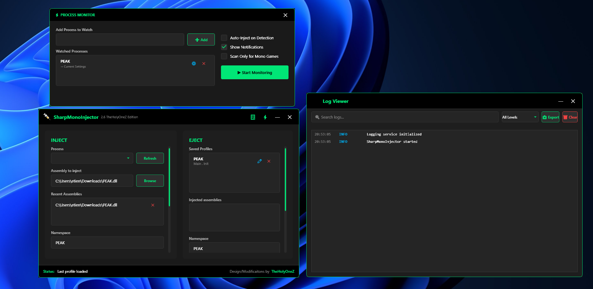

# SharpMonoInjector TheHolyOneZ Edition v2.7

A **modern, fully-featured Mono assembly injector** with **advanced stealth injection**, **real-time logging**, **profile management**, **Thunderstore and r2modman auto-detection**, and a **beautiful dark UI** designed for both power users and security researchers.

This version builds upon **v2.6 TheHolyOneZ Edition**, retaining the complete **visual overhaul**, **stealth injection system**, **performance optimizations**, and all previous features, while introducing **Smart Injection Router**, **Receiver Auto-Detection**, and **Thunderstore integration**.



---

## 🧭 Overview

**SharpMonoInjector** allows injecting managed assemblies into Mono-embedded applications (most commonly Unity Engine based games). Unlike traditional injectors, the target process *does not need to restart* after updating your assembly — ideal for debugging or runtime modding.

Both **x86** and **x64** architectures are supported.

---

## 🆕 What's New in v2.7 (Latest Release)

### 🚀 Major Additions

#### 🛡️ Smart Injection Router

* Automatically detects standard BepInEx installations, Thunderstore Mod Manager, and r2modman profiles.
* Chooses the safest injection method based on the environment:

  * Standard Injection if no BepInEx detected
  * Pipe Injection via Receiver Plugin if BepInEx + plugin found
* Eliminates crashes caused by direct memory injection with BepInEx.
* No manual folder setup needed — automatically finds the Receiver plugin.

#### 📌 Receiver Auto-Detection

* Searches the following paths for `SharpMonoInjectorTheHolyOneZEdition.dll`:

  ```
  GameFolder\\BepInEx\\plugins\\
  AppData\\Roaming\\Thunderstore Mod Manager\\DataFolder\\<GameName>\\profiles\\Default\\BepInEx\\plugins\\
  AppData\\Roaming\\r2modman\\profiles\\<GameName>\\BepInEx\\plugins\\
  ```
* Automatically chooses the correct injection method based on detection.
* Status messages guide the user about which method is used.

#### 💉 Safe Double Injection (Improved)

* Receiver plugin performs automatic two-phase injection to prevent Unity/Photon crashes.
* Logs clearly indicate each pass for better troubleshooting.

#### 🪄 Quality of Life Improvements

* Receiver ping test button to verify communication before injection.
* Improved error recovery when pipe communication fails.
* Thunderstore paths now properly scanned under AppData.
* Router remembers last successful injection path per game.

---

## 🥷 Stealth Injection System (v2.5+)

Retained from v2.5 with all features intact:

### Enable Stealth Mode Checkbox

* One-click toggle for all stealth features
* Visual indicator in the status bar
* Displays: `Injection successful (STEALTH MODE)` upon completion

### Stealth Features

1. **Memory Randomization** – Inserts 4–64 random NOP instructions before shellcode execution to prevent signature-based detection.
2. **Thread Hiding** – Threads created with `CREATE_SUSPENDED` and hidden using `NtSetInformationThread`, then safely resumed.
3. **Execution Delay** – Adds a 150ms randomized delay before injection begins.
4. **Debugger Detection** – Detects if a debugger is attached to the target process.
5. **Code Obfuscation (Experimental, Disabled)** – Encrypts shellcode with XOR and dynamically generates a decoder stub at runtime.

---

## 🎨 Visual & UX Improvements

### Dark Theme & Layout Enhancements

* **Dark Interface:** Deep black and gray tones with neon-green (`#00E676`) accents
* **Rounded Corners:** Subtle 4–8px rounding for buttons, inputs, and containers
* **Card-Based UI:** Inject/Eject/Logs/Profiles sections organized in raised cards (`#FF1E1E1E` background)
* **Smooth Animations:** Hover transitions, click feedback, and fading indicators
* **Premium Typography:** Segoe UI font for modern legibility

### Extended Usability (v2.6+)

* Resizable panels for log viewer and profile list
* Scroll synchronization across panels
* Improved scrollbar styling with green theme
* Persistent window size and layout memory between sessions

---

## 💾 Usage Guide

### Method Signature

```csharp
static void Method()
```

Both **load** and **unload** methods should follow this signature. Unload method is optional.

### How to Inject

1. Select your target Mono process from the dropdown
2. Browse and select your DLL assembly
3. Enter Namespace, Class, and Method
4. Optionally enable **Stealth Mode**
5. Click **INJECT**
6. Watch the **Log Viewer** for injection results

When stealth is active, the status bar will display:

```
Injection successful (STEALTH MODE)
```

### Administrator Privileges

* The GUI automatically requests elevation when needed.
* If denied, a prompt explains manual restart requirements.

---

## 🧩 Logging System (v2.6+)

* Live, color-coded log viewer integrated into the GUI
* Search, filter, export logs
* Logs saved to `DebugLog.txt` for persistence
* Logs all injection steps, stealth alerts, and profile actions

### Log Levels

| Level       | Color  | Description                                   |
| ----------- | ------ | --------------------------------------------- |
| **Info**    | Blue   | Routine actions, refreshes, and general info  |
| **Success** | Green  | Successful injections/ejections               |
| **Warning** | Orange | Debugger detected or minor recoverable issues |
| **Error**   | Red    | Injection or process-related failures         |

---

## 🗂️ Profile Management (v2.6+)

* Create, save, load, rename, and delete multiple injection profiles per game
* Profiles store process name, assembly path, namespace, class, method, and stealth mode preference
* Load profiles instantly to auto-fill injector fields
* Rename ✏️ and delete ✕ icons for convenience

---

## 🔍 Process Monitor (v2.6+)

* Watch processes automatically and trigger injections when targets appear
* Assign profiles to specific processes
* Filter for Mono/Unity-based games only
* Supports background monitoring with configurable polling interval

---

## 🔌 SharpMonoInjector Receiver Plugin v2.7

A companion **BepInEx plugin** that safely receives injections from SharpMonoInjector and handles them internally via named pipes.

### Installation

#### Automatic (Recommended)

* For Thunderstore/r2modman: drag the receiver DLL into:

```
AppData\\Roaming\\Thunderstore Mod Manager\\DataFolder\\<GameName>\\profiles\\Default\\BepInEx\\plugins\\SharpMonoInjectorTheHolyOneZEdition.dll
```

* Works even if not in a subfolder.

#### Manual (Standard BepInEx)

```
YourGame/BepInEx/plugins/SharpMonoInjectorTheHolyOneZEdition.dll
```

### How It Works

* **Communication:** Named Pipe (`SharpMonoInjectorPipe_THOZE`)
* **Tasks:**

  1. Listens for injection requests
  2. Blocks problematic components (PhotonView)
  3. Loads DLL safely into the game
  4. Performs automatic double-injection
* **Logs:** `SmiReceiverLog.txt` and `BepInEx/LogOutput.log`

---

## 🧠 Troubleshooting

* "Connection timed out" → check game running and receiver DLL installed
* "Receiver not found" → plugin missing or in wrong folder
* "BepInEx detected! Receiver plugin required." → install DLL to BepInEx/plugins
* Check logs for `[BLOCKED] PhotonView` and `Double injection complete!`

---

## ⚙️ Performance Impact

| Mode    | Injection Time | Detection Risk      |
| ------- | -------------- | ------------------- |
| Normal  | ~50–100ms      | Higher              |
| Stealth | ~250–350ms     | Significantly Lower |

---

## 🧩 Compatibility

✅ BepInEx 5.4.x+
✅ Thunderstore (AppData-based profiles)
✅ r2modman
✅ Mono/Unity games

---

## 🧾 Version History

### v2.7

* Smart Injection Router with auto-detection
* Receiver Auto-Detection and ping verification
* Improved double-injection stability
* Enhanced Thunderstore path scanning
* Receiver test utilities and fallback recovery
* Minor bug fixes and reliability improvements

### v2.6

* Real-time log viewer and export
* Profile management
* Process monitor
* Extended stealth logging
* UI scaling and performance improvements

### v2.5

* Stealth Injection system
* Thread hiding, memory randomization, execution delay
* Dark theme UI overhaul
* Debugger detection

### Earlier Versions

* wh0am1 Mod: Fixed x86/x64 detection and process bugs
* Warbler Original: Initial Mono injection implementation

---

## 👥 Credits

* **TheHolyOneZ** – Visual overhaul, stealth system, UI redesign, logging, profiles, automation, Smart Router, and Thunderstore integration
* **wh0am1** – Bug fixes and original modernization ([UnknownCheats Thread](https://www.unknowncheats.me/forum/unity/408878-sharpmonoinjector-fixed-updated.html))
* **Warbler** – Original SharpMonoInjector creator ([GitHub](https://github.com/warbler/SharpMonoInjector))

---

## ⚠️ Disclaimer

Intended for educational, research, or personal modding use only. **Do not use for cheating, bypassing anti-cheat systems, or unauthorized modification.**

---

## 📜 License

Retains same license as original SharpMonoInjector by Warbler.

---

**Design, modernization, and enhancements by [TheHolyOneZ](https://github.com/TheHolyOneZ)**
*README updated for v2.7 with Smart Router and Thunderstore integration.*
