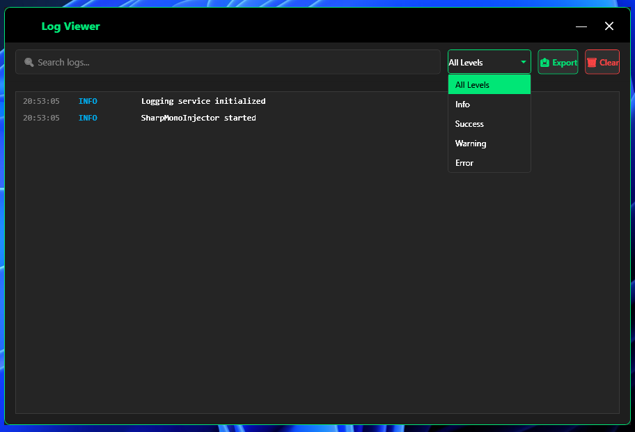
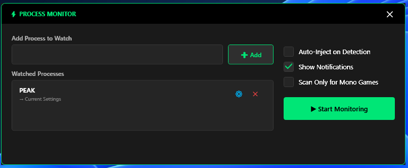

# SharpMonoInjector TheHolyOneZ Edition v2.6

A **modern, fully-featured Mono assembly injector** with **advanced stealth injection**, **real-time logging**, **profile management**, and a **beautiful dark UI** designed for both power users and security researchers.

This version builds upon **v2.5 TheHolyOneZ Edition**, retaining the complete **visual overhaul**, **stealth injection system**, and **performance optimizations**, while introducing new **automation tools**, **real-time insights**, and **workflow efficiency** features.


---

## 🧭 Overview

**SharpMonoInjector** allows injecting managed assemblies into Mono-embedded applications (most commonly Unity Engine based games). Unlike traditional injectors, the target process *does not need to restart* after updating your assembly — ideal for debugging or runtime modding.

Both **x86** and **x64** architectures are supported.

---

## 🆕 What's New in v2.6 (Latest Release)

### 🚀 Major Additions

#### 🖤 Real-Time Logging (NEW)

* Live log viewer integrated directly into the GUI
* Color-coded by level: Info, Success, Warning, Error
* Search and filter logs instantly
* Export logs to `.txt` or `.log`
* Clear logs with one click
* Logs also saved to `DebugLog.txt` for persistence

#### 🧩 Profile Management (NEW)

* Save, load, rename, and delete multiple injection profiles per game
* Profiles store process name, assembly path, namespace, class, method, and stealth mode preference
* Load profiles instantly to auto-fill all injector fields
* Convenient rename ✏️ and delete ✕ icons next to profiles

#### 🔍 Process Monitor (NEW)

* Watch processes automatically and trigger injections when targets appear
* Assign profiles to specific processes for full automation
* Filter for Mono/Unity-based games only
* Supports background monitoring with configurable polling interval

---

## 🥷 Stealth Injection System (Introduced in v2.5)

### Enable Stealth Mode Checkbox

* One-click toggle for all stealth features
* Visual indicator in the status bar
* Displays: `Injection successful (STEALTH MODE)` upon completion

### Stealth Features

1. **Memory Randomization**
   Inserts 4–64 random NOP instructions before shellcode execution.
   Prevents signature-based detection and ensures each injection is unique.

2. **Thread Hiding**
   Threads are created with `CREATE_SUSPENDED` and hidden using `NtSetInformationThread`,
   then safely resumed to evade enumeration and scanning tools.

3. **Execution Delay**
   Adds a 150ms randomized delay before injection begins, reducing behavioral detection patterns.

4. **Debugger Detection**
   Detects if a debugger is attached to the target process and displays a warning.

5. **Code Obfuscation** *(Experimental - Disabled by default)*
   Encrypts shellcode with XOR and dynamically generates a decoder stub at runtime.

---


## 🎨 Visual & UX Improvements (Inherited + Enhanced)

### From v2.5: Dark Theme & Layout Enhancements

* **Dark Interface:** Deep black and gray tones with neon-green (`#00E676`) accents
* **Rounded Corners:** Subtle 4–8px rounding for all buttons, inputs, and containers
* **Card-Based UI:** Inject/Eject/Logs/Profiles sections organized in raised cards (`#FF1E1E1E` background)
* **Smooth Animations:** Hover transitions, click feedback, and fading indicators
* **Premium Typography:** Segoe UI font for modern legibility

### From v2.6: Extended Usability

* Resizable panels for log viewer and profile list
* Scroll synchronization across panels
* Improved scrollbar styling with consistent green theme
* Persistent window size and layout memory between sessions

---

## 💾 Usage Guide

### Method Signature

```csharp
static void Method()
```

Both **load** and **unload** methods should follow this signature. The unload method is optional but recommended for clean resource management.

### How to Inject

1. Select your target Mono process from the dropdown
2. Browse and select your DLL assembly
3. Enter Namespace, Class, and Method
4. Optionally enable **Stealth Mode**
5. Click **INJECT**
6. Watch the **Log Viewer** for injection results

When stealth is active, the status bar will display:

```
Injection successful (STEALTH MODE)
```

### Administrator Privileges

* The GUI automatically requests elevation when needed.
* If denied, a prompt explains manual restart requirements.

---

## ⚙️ Performance Impact

| Mode    | Injection Time | Detection Risk      |
| ------- | -------------- | ------------------- |
| Normal  | ~50–100ms      | Higher              |
| Stealth | ~250–350ms     | Significantly Lower |

> **Worth the extra 200ms for enhanced stealth.**

---

## 🧩 Logging System (v2.6)


### Log Levels

| Level       | Color  | Description                                   |
| ----------- | ------ | --------------------------------------------- |
| **Info**    | Blue   | Routine actions, refreshes, and general info  |
| **Success** | Green  | Successful injections/ejections               |
| **Warning** | Orange | Debugger detected or minor recoverable issues |
| **Error**   | Red    | Injection or process-related failures         |

### What Gets Logged

* Process refresh events
* Detection and enumeration results
* Injection/ejection start and completion
* Warnings and stealth alerts
* Profile load/save actions
* Process monitor detections

---

## 🗂️ Profile Management (v2.6)

### Features

* Create new profiles or save current injector configuration
* Rename, duplicate, or delete profiles
* Automatically load last used profile on startup
* Organized by process name or custom label

### How to Use

1. Configure your desired injection settings
2. Click **Save Profile** and name it
3. Later, click **Load Profile** to restore instantly
4. Rename or delete as needed

---

## 🔍 Process Monitor (v2.6)

### Overview

Allows SharpMonoInjector to automatically inject when a target process starts.


### How to Use

1. Add a process to the watch list
2. Choose between **Current Settings** or **Saved Profile**
3. Start Monitoring
4. Injection executes automatically when detected

Includes optional filters to show only Mono or Unity-based processes.

---

## 📊 Anti-Detection Capabilities

When **Stealth Mode** is active:

✅ Evades Static Signatures – Random NOP padding breaks consistent patterns
✅ Evades Memory Scanners – Randomized shellcode layout
✅ Evades Thread Enumeration – Threads hidden via `NtSetInformationThread`
✅ Evades Timing Analysis – Randomized execution delays
✅ Debugger Awareness – Warns if target process has active debugger

### Recommended Use Cases

* Game modding in offline or single-player environments
* Software security research
* Dynamic code injection testing in controlled systems

---

## 🧾 Version History

### v2.6 (TheHolyOneZ Edition)

* Added real-time log system with color-coded viewer and export
* Introduced profile management (save/load/rename/delete)
* Added process monitor for automated injections
* Extended stealth injection logging
* Improved UI scaling and performance
* Minor bug fixes and code cleanup

### v2.5 (TheHolyOneZ Edition)

* Implemented stealth injection system (memory randomization, thread hiding, etc.)
* Fixed ComboBox process display bug
* Added debugger detection and better thread lifecycle management
* Major dark theme UI overhaul and layout improvements
* Updated to .NET Framework 4.8

### Earlier Versions

* wh0am1 Mod: Fixed x86/x64 detection, process bugs, and privilege handling
* Warbler Original: Initial Mono injection implementation

---

## 👥 Credits

* **TheHolyOneZ** – Visual overhaul, stealth system, UI redesign, logging, profiles, and automation
* **wh0am1** – Bug fixes and original modernization ([UnknownCheats Thread](https://www.unknowncheats.me/forum/unity/408878-sharpmonoinjector-fixed-updated.html))
* **Warbler** – Original SharpMonoInjector creator ([GitHub](https://github.com/warbler/SharpMonoInjector))

---

## ⚠️ Disclaimer

**This software is intended for educational and legitimate testing purposes only.**
It is **not** to be used for cheating, bypassing anti-cheat systems, or unauthorized software modification.

Allowed use cases:

* Game mod development in personal or research contexts
* Security testing and controlled vulnerability research
* Reverse engineering for learning purposes

Prohibited use cases:

* Multiplayer cheating
* Commercial software exploitation
* Illegal or unethical activities

---

## 📜 License

This project retains the same license as the original **SharpMonoInjector** by Warbler.

---


Report Bugs Here: 


**Design, modernization, and enhancements by [TheHolyOneZ](https://github.com/TheHolyOneZ)**
*README enhanced with GPT-5 assistance for structured clarity and extended documentation.*
