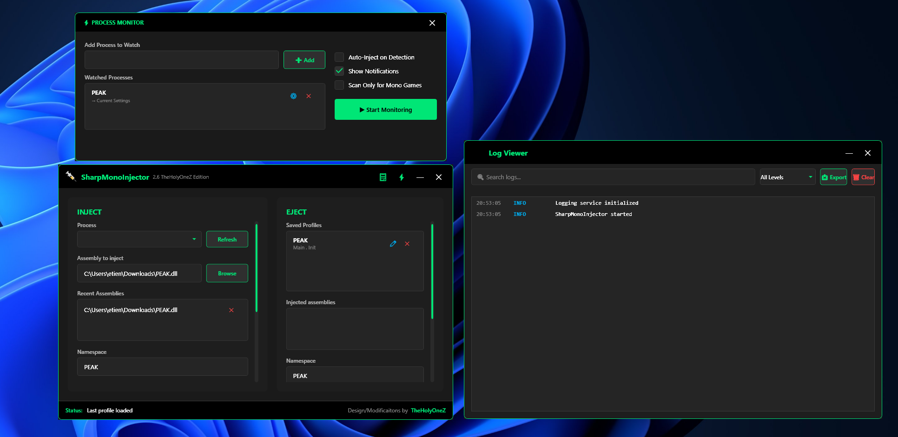

# SharpMonoInjector TheHolyOneZ Edition v2.8.0

A **modern, fully-featured Mono assembly injector** with **advanced stealth injection**, **real-time logging**, **profile management**, **Thunderstore and r2modman auto-detection**, and a **beautiful dark UI** designed for both power users and security researchers.

This version builds upon **v2.7.5 TheHolyOneZ Edition**, retaining all previous features, while introducing an **injection delay slider**, **system tray icon**, **auto-refresh process list**, **process status indicators**, **assembly version display**, plus fixes for panel scrolling, injection field validation feedback, and auto-refresh reliability.


* The images are from an older version. The newest release and source code are actually the latest, so don’t be fooled. The source code and newest release are version 2.7.

Showcase: https://www.youtube.com/watch?v=SvfFgVl7a90

---

## 🧭 Overview

**SharpMonoInjector** allows injecting managed assemblies into Mono-embedded applications (most commonly Unity Engine based games). Unlike traditional injectors, the target process *does not need to restart* after updating your assembly — ideal for debugging or runtime modding.

Both **x86** and **x64** architectures are supported.

---

## 🆕 What's New in v2.8.0 (Latest Release)

### New Features
- **Injection delay slider** — Set a 0–5000 ms delay before injection. Useful for games that need a moment to finish loading Mono.
- **System tray icon** — Minimize to tray. Double-click to restore, right-click for quick inject or exit.
- **Auto-refresh process list** — Enable a 5–60 s background scan timer so newly launched games appear automatically.
- **Process status dots** — Green/red indicator next to each process, polled every 3 seconds.
- **Assembly version display** — Version and architecture shown below the DLL path after selection.

### Bug Fixes
- **Panel scrolling** — Mouse wheel now works anywhere over the inject panel, not just on the scrollbar.
- **Validation feedback** — Class/Method fields highlight red and show "Required" only after clicking Inject, with a status bar message naming the missing field.
- **Auto-refresh reliability** — Uses the same scan path as the manual Refresh button.
- **Dependency injection crash** — `InjectWithDependencies` no longer passes empty strings to `Inject()`.
- **Log rotation** — `DebugLog.txt` capped at 5 MB, rotated to `.old.txt`.
- **Right-click → Copy Path** on recent assembly entries.
- **Confirmation before Clear All**.

---

## What's New in v2.7.1

### 🚀 Major Additions

#### 🛡️ Smart Injection Router

* Automatically detects standard BepInEx installations, Thunderstore Mod Manager, and r2modman profiles.
* Chooses the safest injection method based on the environment:

  * Standard Injection if no BepInEx detected
  * Pipe Injection via Receiver Plugin if BepInEx + plugin found
* Eliminates crashes caused by direct memory injection with BepInEx.
* No manual folder setup needed — automatically finds the Receiver plugin.

#### 📌 Receiver Auto-Detection

* Searches the following paths for `SharpMonoInjectorTheHolyOneZEdition.dll`:

  ```
  GameFolder\\BepInEx\\plugins\\
  AppData\\Roaming\\Thunderstore Mod Manager\\DataFolder\\<GameName>\\profiles\\Default\\BepInEx\\plugins\\
  AppData\\Roaming\\r2modman\\profiles\\<GameName>\\BepInEx\\plugins\\
  ```
* Automatically chooses the correct injection method based on detection.
* Status messages guide the user about which method is used.

#### 💉 Safe Double Injection (Improved)

* Receiver plugin performs automatic two-phase injection to prevent Unity/Photon crashes.
* Logs clearly indicate each pass for better troubleshooting.

#### 🪄 Quality of Life Improvements

* Receiver ping test button to verify communication before injection.
* Improved error recovery when pipe communication fails.
* Thunderstore paths now properly scanned under AppData.
* Router remembers last successful injection path per game.

#### ⌨️ Keybinds

* Keyboard shortcuts for common actions to improve workflow efficiency.

#### 🔍 Inspector

* Built-in assembly inspector for examining loaded assemblies and their contents.

#### 🔧 Fixed Eject Button

* Resolved issues with the eject functionality for better reliability.

#### 🔄 Reload and Force Remove Buttons

* Reload button to refresh injected assemblies without restarting the process.
* Force remove button to forcibly eject assemblies if needed.

#### 📁 Profile Management Enhancements

* Moved saved profiles from eject side to inject side for better organization.
* Redesigned the saved profiles UI with improved layout.
* Enhanced edit name profile UI for easier profile management.

#### 📦 Auto-Inject Dependencies

* Toggle button for automatic dependency injection.
* Custom dependencies paths support:
  * If auto-inject is enabled but no custom path is set, dependencies are searched in the same folder as the selected DLL.
  * If a custom path is specified, dependencies are loaded from that folder.
* All new fields and options are saved via profile, fully integrated with the profile system.

---

## 🥷 Stealth Injection System (v2.5+)

Retained from v2.5 with all features intact:

### Enable Stealth Mode Checkbox

* One-click toggle for all stealth features
* Visual indicator in the status bar
* Displays: `Injection successful (STEALTH MODE)` upon completion

### Stealth Features

1. **Memory Randomization** – Inserts 4–64 random NOP instructions before shellcode execution to prevent signature-based detection.
2. **Thread Hiding** – Threads created with `CREATE_SUSPENDED` and hidden using `NtSetInformationThread`, then safely resumed.
3. **Execution Delay** – Adds a 150ms randomized delay before injection begins.
4. **Debugger Detection** – Detects if a debugger is attached to the target process.
5. **Code Obfuscation (Experimental, Disabled)** – Encrypts shellcode with XOR and dynamically generates a decoder stub at runtime.

---

## 🎨 Visual & UX Improvements

### Dark Theme & Layout Enhancements

* **Dark Interface:** Deep black and gray tones with neon-green (`#00E676`) accents
* **Rounded Corners:** Subtle 4–8px rounding for buttons, inputs, and containers
* **Card-Based UI:** Inject/Eject/Logs/Profiles sections organized in raised cards (`#FF1E1E1E` background)
* **Smooth Animations:** Hover transitions, click feedback, and fading indicators
* **Premium Typography:** Segoe UI font for modern legibility

### Extended Usability (v2.6+)

* Resizable panels for log viewer and profile list
* Scroll synchronization across panels
* Improved scrollbar styling with green theme
* Persistent window size and layout memory between sessions

---

## 💾 Usage Guide

### Method Signature

```csharp
static void Method()
```

Both **load** and **unload** methods should follow this signature. Unload method is optional.

### How to Inject

1. Select your target Mono process from the dropdown
2. Browse and select your DLL assembly
3. Enter Namespace, Class, and Method
4. Optionally enable **Stealth Mode**
5. Click **INJECT**
6. Watch the **Log Viewer** for injection results

When stealth is active, the status bar will display:

```
Injection successful (STEALTH MODE)
```

### Administrator Privileges

* The GUI automatically requests elevation when needed.
* If denied, a prompt explains manual restart requirements.

---

## 🎛️ User Interface Overview

### Main Window Layout

The main window is divided into two primary sections: **INJECT** (left) and **EJECT** (right), providing a clear separation of injection and ejection operations.

#### INJECT Section

* **Process Selection:** Dropdown list of running processes with refresh button (F9)
* **Assembly Input:** Text field for DLL path with browse button (Ctrl+O) and inspect button (Ctrl+I)
* **Recent Assemblies:** List of previously used assemblies with quick selection and removal options
* **Saved Profiles:** Enhanced profile management with detailed cards showing profile info, edit name (✏️), and delete (🗑️) buttons
* **Injection Fields:** Namespace, Class, Method name inputs
* **Stealth Mode:** Toggle for advanced injection options
* **Auto-Inject Dependencies:** Toggle with custom dependency paths (one per line)
* **Profile Management:** Save current settings as profile or clear all recents

#### EJECT Section

* **Injected Assemblies:** List of currently loaded assemblies
* **Ejection Fields:** Namespace, Class, Method inputs for unload
* **Action Buttons:** RELOAD (🔄) for hot-swapping, EJECT for standard removal, FORCE REMOVE (🗑️) for problematic assemblies

#### Status Bar

* Real-time status updates with progress bar during operations
* Context menu for copying status text
* Credits link to developer

### Keyboard Shortcuts

The application supports the following keyboard shortcuts for efficient operation:

| Shortcut | Action | Description |
|----------|--------|-------------|
| **Ctrl+O** | Browse for assembly file | Opens file dialog to select DLL/EXE assembly |
| **Ctrl+I** | Open assembly inspector | Launches the assembly introspection tool |
| **F5** | Inject assembly | Executes injection with current settings |
| **F6** | Eject assembly | Removes injected assembly using current settings |
| **F9** | Refresh process list | Updates the dropdown with currently running processes |
| **Ctrl+L** | Open log viewer | Displays the comprehensive logging interface |

### Inspector Tool

The Assembly Inspector (Ctrl+I) provides deep introspection of .NET assemblies:

* **Load Assembly:** Enter or browse to DLL path and load for analysis
* **Namespace Browser:** Hierarchical view of all namespaces in the assembly
* **Class Explorer:** Detailed class information with full names and inheritance
* **Method Inspector:** Complete method signatures, return types, and parameters
* **Auto-Population:** "Select Method" button automatically fills injection fields in main window

### Process Monitor

The Process Monitor (⚡ button) enables automated injection workflows:

* **Watch List:** Add processes by name to monitor for appearance
* **Profile Assignment:** Assign specific injection profiles to watched processes
* **Auto-Injection:** Toggle automatic injection when target processes start
* **Notifications:** Desktop alerts when monitored processes are detected
* **Mono Game Filter:** Option to scan only for Unity/Mono-based applications
* **Background Monitoring:** Continuous process scanning with configurable intervals

### Log Viewer

The Log Viewer (📋 button or Ctrl+L) provides comprehensive logging and debugging:

* **Real-time Logs:** Color-coded entries with timestamps and severity levels
* **Search & Filter:** Full-text search and level-based filtering (Info, Success, Warning, Error)
* **Export Functionality:** Save logs to file for analysis
* **Context Actions:** Right-click menu for copying individual log entries
* **Persistent Storage:** Logs saved to DebugLog.txt for session continuity

---

## 🧩 Logging System (v2.6+)

* Live, color-coded log viewer integrated into the GUI
* Search, filter, export logs
* Logs saved to `DebugLog.txt` for persistence
* Logs all injection steps, stealth alerts, and profile actions

### Log Levels

| Level       | Color  | Description                                   |
| ----------- | ------ | --------------------------------------------- |
| **Info**    | Blue   | Routine actions, refreshes, and general info  |
| **Success** | Green  | Successful injections/ejections               |
| **Warning** | Orange | Debugger detected or minor recoverable issues |
| **Error**   | Red    | Injection or process-related failures         |

---

## 🗂️ Profile Management (v2.6+)

* Create, save, load, rename, and delete multiple injection profiles per game
* Profiles store process name, assembly path, namespace, class, method, and stealth mode preference
* Load profiles instantly to auto-fill injector fields
* Rename ✏️ and delete ✕ icons for convenience

---

## 🔍 Process Monitor (v2.6+)

* Watch processes automatically and trigger injections when targets appear
* Assign profiles to specific processes
* Filter for Mono/Unity-based games only
* Supports background monitoring with configurable polling interval

---

## 🔌 SharpMonoInjector Receiver Plugin v2.7

A companion **BepInEx plugin** that safely receives injections from SharpMonoInjector and handles them internally via named pipes.

### Installation

#### Automatic (Recommended)

* For Thunderstore/r2modman: drag the receiver DLL into:

```
AppData\\Roaming\\Thunderstore Mod Manager\\DataFolder\\<GameName>\\profiles\\Default\\BepInEx\\plugins\\SharpMonoInjectorTheHolyOneZEdition.dll
```

* Works even if not in a subfolder.

#### Manual (Standard BepInEx)

```
YourGame/BepInEx/plugins/SharpMonoInjectorTheHolyOneZEdition.dll
```

### How It Works

* **Communication:** Named Pipe (`SharpMonoInjectorPipe_THOZE`)
* **Tasks:**

  1. Listens for injection requests
  2. Blocks problematic components (PhotonView)
  3. Loads DLL safely into the game
  4. Performs automatic double-injection
* **Logs:** `SmiReceiverLog.txt` and `BepInEx/LogOutput.log`

---

## 🧠 Troubleshooting

* "Connection timed out" → check game running and receiver DLL installed
* "Receiver not found" → plugin missing or in wrong folder
* "BepInEx detected! Receiver plugin required." → install DLL to BepInEx/plugins
* Check logs for `[BLOCKED] PhotonView` and `Double injection complete!`

---

## ⚙️ Performance Impact

| Mode    | Injection Time | Detection Risk      |
| ------- | -------------- | ------------------- |
| Normal  | ~50–100ms      | Higher              |
| Stealth | ~250–350ms     | Significantly Lower |

---

## 🧩 Compatibility

✅ BepInEx 5.4.x+
✅ Thunderstore (AppData-based profiles)
✅ r2modman
✅ Mono/Unity games

---

## 🧾 Version History

### v2.7.1

* Added comprehensive keybinds for improved workflow efficiency
* Assembly Inspector tool for deep introspection of .NET assemblies
* Fixed eject button functionality for reliable assembly removal
* Added reload and force remove buttons for advanced ejection options
* Moved saved profiles to inject side with redesigned UI and enhanced profile cards
* Enhanced edit name profile UI with improved user experience
* Auto-inject dependencies toggle with custom paths support (searches same folder if no custom paths set)
* Profile system integration for all new fields and options
* Process Monitor with automated injection workflows and background monitoring
* Enhanced Log Viewer with search, filtering, and export capabilities
* Improved UI layout with better organization and visual hierarchy

### v2.7

* Smart Injection Router with auto-detection
* Receiver Auto-Detection and ping verification
* Improved double-injection stability
* Enhanced Thunderstore path scanning
* Receiver test utilities and fallback recovery
* Minor bug fixes and reliability improvements

### v2.6

* Real-time log viewer and export
* Profile management
* Process monitor
* Extended stealth logging
* UI scaling and performance improvements

### v2.5

* Stealth Injection system
* Thread hiding, memory randomization, execution delay
* Dark theme UI overhaul
* Debugger detection

### Earlier Versions

* wh0am1 Mod: Fixed x86/x64 detection and process bugs
* Warbler Original: Initial Mono injection implementation

---

## 👥 Credits

* **TheHolyOneZ** – Visual overhaul, stealth system, UI redesign, logging, profiles, automation, Smart Router, and Thunderstore integration
* **wh0am1** – Bug fixes and original modernization ([UnknownCheats Thread](https://www.unknowncheats.me/forum/unity/408878-sharpmonoinjector-fixed-updated.html))
* **Warbler** – Original SharpMonoInjector creator ([GitHub](https://github.com/warbler/SharpMonoInjector))

---

## ⚠️ Disclaimer

Intended for educational, research, or personal modding use only. **Do not use for cheating, bypassing anti-cheat systems, or unauthorized modification.**

---

## 📜 License

Retains same license as original SharpMonoInjector by Warbler.

---

**Design, modernization, and enhancements by [TheHolyOneZ](https://github.com/TheHolyOneZ)**
*README updated for v2.7.1 with comprehensive UI overview, keybinds, inspector tool, process monitor, enhanced log viewer, auto-inject dependencies, and profile system improvements.*


